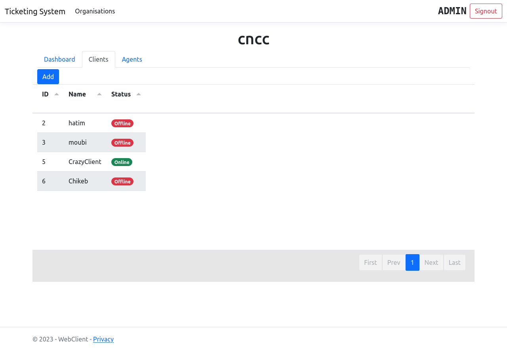

#Introduction
Un système de ticket il vous aider à améliorer votre service client en fournissant un moyen centralisé, organisé et efficace de gérer les demandes des clients. Il simplifie le processus d'assistance à vos clients en catégorisant et en priorisant leurs demandes, en les affectant aux membres de l'équipe appropriés et en fournissant des réponses en temps réel.
# Technologies

![tabulator](https://img.shields.io/badge/Tabulator-49ad4a?style=for-the-badge&logo=data:image/png;base64,iVBORw0KGgoAAAANSUhEUgAAADIAAABICAYAAAC0hqYWAAAABGdBTUEAALGPC/xhBQAAACBjSFJNAAB6JgAAgIQAAPoAAACA6AAAdTAAAOpgAAA6mAAAF3CculE8AAAABmJLR0QA/wD/AP+gvaeTAAAACXBIWXMAAAsTAAALEwEAmpwYAAAAB3RJTUUH5wIJFgsTv7zapwAABKZ6VFh0UmF3IHByb2ZpbGUgdHlwZSB4bXAAAFiFrVhblqM6DPzXKmYJYNkyXg4J8Dfn3M+7/KmSCY9Ak6S7O6eJMbZcepSkIP///U/+4C+oBtG7TrnLjbWmdrOUY2gsWLJsxUYdQhin2+02hYD5YpEzKWuKgzZxyE1UrO2sSOxyn7Exae7jmKLhGwJVsSkEnXQMjd5zp33uDBtt4GHWhob3drcxK58JTwCaaBNxaF8fLMsdySoGczfuiMuO0KQuDqmRQHBT9inNYdQ2DMDT8MMZLWG0VjuMVFsLuL9jPij/cRC+C6+Cr8G39ViY/dqF5ukTZgUDcJj2KcQYba+czA+pYJcjPhAJhabsf2HMWAVMxJxxcquFH0cScA24DpQhZhhohodok9xBMZzA53sUgABnwRXBituqwEZY8XguMHTAeTAtUVXTbr1BEx/x+mHj6qQwCqJnsgGqdMDTEDwM3jy8tYrEFj0xQAMIwe4UNGvPhbgmbEx0PlXFqVVwexRcscYBgeni5RrwV3ghcNgLF5euOcaUrdrplTXOhQsmQJwMT2DRlIL7ZnLNwSKKr2rSj0/K4Xiur8Ej3zv/eLxsz6/yT85uwO8JsYPtPjoJCLnAcNh+DA6KiQzShID0pSFR0GT3A7eP4khXdYFN6JLnLVKErNJQjmf4ESnG+s0DZs4Hp7ni2mpOkVkAFOEDcL7VmPqdsDkjWRXUvhIoD4m4Rr/mg0BGfTHL5UqYbOE9C3N+9WZOo4FC3FuFY+T05A4ZQTCslQ1n+shkoq7Q6OEIDNxa18CfxdN/rwkHIoLUqDiMPkA13LSKnATjRjxOmCzAAZth1HELNjDlGnMnxsjwq+ozAPgUaSQvbH8g2BUDjrQiOQnM3qq1THDpmOPc9gXnEhNSvjIGgA7LChH7s0xl8KRzfAX/8YFOFng0aKllEYju0ZEc0S72irO94CxNFhhHigk40FVhDWE5IqLW5+BDg5OxJmMeloRgmBmlqTWmcCKCyvKsM6scyAp8cwTVqFmLwdbIKNXuZayWXJ5qFtye2/0cBBecu6a/np3Co5K4e1RWVlk13Hb5u3FFitBQv2En2SLIGZZKFewV0w9EhwxZhNDIGEFYS3Wjs4mOfy9DyTFFbTLU9L7RpSoC2a3Xi28bnBRBroE5SU+lcWHkxA4JI5YatlugL2eMRMZi2sv5mDgHwnRm8ozgQ4PHR+7ae+0HBpfzmrArCVuLcRutlT1/sRGaqlPkMyp87RR51ytzAmPkM0syQxnc0nBkTpFKg1ZJjdqYtu5J3MNT6GY36fXCKXLhlX15euEU+YQGV06Rd73yyinynKA4ol9yOM9R/PmTWWdqSec6rY0WCqW3MVzA7IvTTD3V1U56glgosW99joWJquHWf0IdC/Hn7DcHiVR+GmxfqbM1hMyWaH6qoqzu/ZmK8i6XXlFJrlqVTzoV2bUq30twTiV5l0uvqCTvcukVlWTLpTCddQD+8+G0cVj6hl1/tAvJuETV5qfLpefkkyx4lQTlLAsuCD7o2n63G1kQ/KCP/C1Ekzw7/vxFwSE8/KXGGh58pbF7mVMfnbxRSgxPVyvUl0HyD2HVNoNCmLG+AAAHnklEQVRo3s2bWYwURRjHf9Uz7IosiODiARFjxAdBjSa4BH3x5tIgmBhNPB4U8IhRo2/GJ6MvJoZ44YXXA4iCiwhI5BJFLhXkUCEEcFVAQHA5ltmZ6S4fvmq2p6d7prunB+afVDJTU1Vd//qqvu+r7+tRpIixc8e5H3sDE4G+wDuLJy9K8zGByKZMIAO0AY8BdwAf151BGkQ8BABGAFOBe4BWU6cXT14EU64DS0nNjHWNQ8RH4BLgIVOGVuh2FpBjWltdCMUi4iMwCFn9qcDwih01ANOAXsAnwP60CUUi4iPQF7gTOQdtyLmoDNlVlwGPAncDbwLtQGdahKwYJJqBscBs4D1gdCQSAO+sB3DM864D3gbmIArhLIBThBIiVCIeAhay8o+bB/er6Yk9i3KbWYyFwBvAD0xrs4FE0ikj4ttGw+nRRINSIOBHixn7ZuAzYAawOcl2O0XER2AoPZrokjoQ8OM85PyMR2zPTGB3HEJZH4FWs0JTgCtPAwE/LgaeByYB7wKzgH+iEHIPewtwL/AF8OoZIuHFFcAriGa7H/dcTmsLVQpZYBwi1ltwNUhjIAOMAq4B7gNeB5YRYlQtRBITGoyEQGsQDTcG2WYzgetx1b5HOlnE0o4Hzq02LJBH7EEUKKDg+e4ARVw7H2kElaFn+/dFFv0WxAa9DWxxyWSB7025I3xhNEqpzozKPGtruyPGmnrbvg+siEoka2WaFTxfsItXoZT3p1bEpk0APgI+APZkgS7EWt8ONIUvr8qfnT37u2OFYztiEPFiiymR8PRN9/Z67ds5Uwp2MazJUOAFRMO95dqRpcA25GCFQqOziS9JMa31hmHXZtHVXSjk+jDCMhM7AMwlzv5tHOwDPvS6KF8grvaQuCNNbL8L2xE3yVIW8+9qr9h+wDO30pXPoYGMZTGgTz/+enlBUiLfABstACOV7cDXSUZSqP7AMFNaI/Toh/hxI9AM7S7kVfU+gXDPd8G7B21TeSzOSBv2b8DW9gNFXVxhyuPV+uTt/I3ddmFZvphfXnCK01v7npvUhm0AVoPnPmKkshZYE2ekIS2DcbR9qdZ6sCn9q/XRWjdrrQdprVsd7Qw70nWsJQEJG/gUOMqMdWVa4QQilWLU0V5c+1JGw0UASvR9VIXhCCn6O45TlXwAdiJ3GSD4hrgE+D3qaEfzR3ujuTDBRBAiuiVXzA+M2w2YD/zpqvWSi9XiyYsYO3fcXkSDDce9bRsoVHHCvFIHIFfM9dbouBPxzqm34zitzU/cUFJ79ZDLi2t3bw1zh/4FPscj/bCr7lzgEeCCniXQTXknf3PWyg7zENQFp3ARNdweNWSLjj2uOdvU7K3/aO3CJkc754d0Ww784jWyZUSMVLYh+vl+IwqAc7rt7umUnwEFZJVKqkFRJwvdU3KF/MP+eo0O2vo5xBPOeyvDJFI0jScBfRQKjVZoegVPBRSJiYDWVsikoXyBNgLf+isDOxtVvBrR02auCqVCSi0k3MmGlVI4iAt/xO+7VXLKjiJ62q5tlqliD/Bl0A/VvMtFiL5uFCwA9gR50qFEzPb6E9HXjeAVH0G2VaBKriYRjQTODp1pFsAq4Oewe01FIkYqmxG9fSbRjWjRXFiDKDewvBnkpP8HHbzjooyp8AfAtXajJkHYgoSCQhE1P7IK0d+jS2ejfgPWlVTB+gg8OpD97pLWlpUZ7GhnFFpbPrXrIO7IoUrX5apEjKV3D9ooSld8KfCkt33Gqp5pyFjWGt8CMLDPORMPnfhvttZlhvEvJOJYEVG2gYsFwG5fXdlecHT1sJdp43iLUqHxMjEBVYIXkbaWkcoeQ+Yp/29xcXz6yvLK58YENY1slONIxHUPDseeeXKsBtZHSitEHdFIZSNy8Ceaau1LSwT2A6qm1pRS/lUvINqyK8r84qanXRd6LBJcvhQJXYZ5jbuBrebztUiUJRCdXcdHUnrQf0WuEpGQJM++HDGSI5GUxO0V2r4JPG0+Pwg8EdJO54p5BSh67v3zgP1RI5Rxzoi7TQ4het1BjFpTheLVxco8L6i4UXdXsvsMkciIRcSDdsShrBckABIjXhybiJHKTkS/1wPHiRmSSkTEwEH0e2cdiKwDfogbvU9ExEjlVLgyRRQRaRyP2zGpRED0+yxK02u1YgewOEnHWoiA6PltKZHQSGDw7ySvcCQmYrbXP4iaTOMqfBAJDCZCrRLBENmbwjhLga1JX3eqiYgnQbSkRhI1n7c0JJJY03jwE/BdLS+f1UzESGUNkiRKAjdhU5NNSkMikNAaG+wCvqp1AmkRAUmkbo/Zx03YdNT9ncYoMNvrb8SZjKOKDyMBwJrVd5oSAXHvD8RovwJfwuaMEzFS2YbYgyhwb5vdaTw/bYnEuWdvAlam9eC0iYC8MvVjlTYOcjYOp/UmdqpEzPbqROxCpUjdH4QkbBqCiAcLkexS2PhfAbvSfNE/dSJGKh3IiqsJ7WVxr/+okLBpGCIGboLoQEDaehXwU9p/u6gLESOVTcBy29ZeJq6DeTLBsKefiEEXsEYptAmXZpDoYVQ70zBEoNSJdBM2B+vx96RU/iwWhJJ0g0ikg4SBhSiot0S8z1kB7KjXn8X+Bx6djykT+BPzAAAAJXRFWHRkYXRlOmNyZWF0ZQAyMDIzLTAyLTA5VDIyOjExOjE5KzAwOjAwamdDyAAAACV0RVh0ZGF0ZTptb2RpZnkAMjAyMy0wMi0wOVQyMjoxMToxOSswMDowMBs6+3QAAAAASUVORK5CYII=&color=green)
# Installation
1. [Télécharger docker desktop](https://www.docker.com/products/docker-desktop/)
2. Cloner le projet
``git clone https://github.com/shawpoufo/TicketingSystem.git``
3. Se positionner sur le dossier du projet
 `cd TicketingSystem`
 4. Lancer application à l'aide de docker-compose
 `docker-compose up`
 5. Lancer le l'adresse de l'application front dans le navigateur web
 `http://localhost:5005/`
# Adresses des micro-service
 - application front-end : [http://localhost:5005 ](http://localhost:5005/)
 - GateWay : [http://localhost:5000 ](http://localhost:5000/)
 - CustomIdentity : [http://localhost:5001 ](http://localhost:5001/)
 - Ticket : [http://localhost:5002](http://localhost:5002/)
 - Organisation : [http://localhost:5003](http://localhost:5003/)
 - Conversation : [http://localhost:5004](http://localhost:5004/)
# Captures d'écran
## Page d'acceuil

## Page de connection

## Page d'enregistrement

## Page de list des organismes
Un organisme est une entité qui rassemble tous vos clients de votre produit et les agents qui vont résoudre leur problème.

## Formulaire pour ajouter un organisme

## Tableau de bord de l'admin
À partir de ce tableau de bord l'admin peut suivre l'état d'avancement des problèmes postuler par les clients en temps réel, chaque ticket est un problème qui doit être résolue par un agent, un ticket dispose de trois états.

### Attribuer un ticket à un agent
Afin de attribuer un ticket il va faloir avoire un agent sinon ajouter le dans l'onglet des agents

## Onglet des client
La page des clients affiche les clients d'un organisme choisi ainsi que l'état de leur présence (online/offline) en temps-réel

## Tableau de bord du client
à travers cette page le client peut :
- Remplire un nouveau ticket
- Consulter l'état d'anvancement des ticket
- Communiquer en temps-réel (chat) avec l'agent
*NOTE : l'agent dispose d'une interface similaire*

